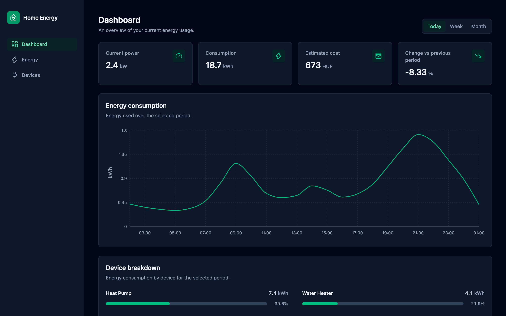
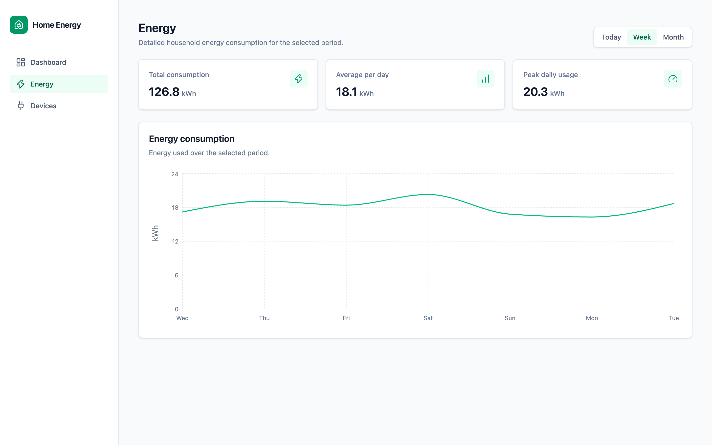
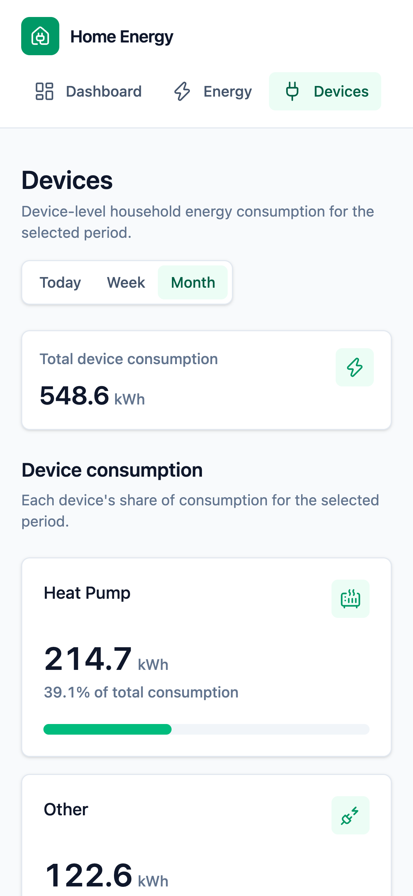

**Live demo:** https://home-energy-dashboard-seven.vercel.app/

# Home Energy Dashboard

Home Energy Dashboard is a responsive frontend application for visualizing household electricity consumption, costs, trends, and device-level energy usage.

The project focuses on a production-style frontend architecture with typed data flows, realistic API interactions, responsive data visualization, and complete asynchronous UI states.

The application currently uses Mock Service Worker (MSW) to provide a realistic API layer rather than relying on a real backend.

## Features

- Energy overview with current power, consumption, estimated electricity cost, and change from the previous period
- Today, Week, and Month views backed by range-specific API data
- Responsive household consumption line chart
- Device-level consumption breakdown with percentage shares
- Dedicated Energy page with total, average, and peak consumption statistics
- Dedicated Devices page with detailed device cards
- Loading, error, and empty states for asynchronous content
- Responsive navigation and page layouts
- Dark mode based on the operating system or browser color preference
- Route-level code splitting for the secondary Energy and Devices pages

## Tech Stack

| Area               | Technology                           |
| ------------------ | ------------------------------------ |
| UI                 | React, TypeScript, Tailwind CSS      |
| Build tooling      | Vite                                 |
| Routing            | React Router                         |
| Server state       | TanStack Query                       |
| Data visualization | Recharts                             |
| Mock API           | Mock Service Worker                  |
| Testing            | Vitest, React Testing Library, jsdom |
| Icons              | Lucide React                         |

## Architecture

The application follows a small, explicit data flow:

```text
MSW mock API
  -> service functions using fetch
  -> TanStack Query hooks
  -> route/container components
  -> page and shared presentation components
```

MSW lets the frontend communicate through real HTTP requests and responses while keeping a backend outside the scope of the portfolio project. The same API contracts can therefore drive development and integration tests without mocking `fetch` or replacing query hooks.

Responsibilities are separated by directory:

- `src/services`: endpoint-specific HTTP requests and response handling
- `src/hooks/api`: TanStack Query hooks and range-aware query keys
- `src/pages`: route containers, page-level state, and page presentation
- `src/components`: shared UI and energy-domain components
- `src/utils`: derived cost, comparison, and consumption-statistics calculations
- `src/types`: shared energy API and domain types
- `src/mocks`: MSW handlers and range-specific fixture data

## Engineering Decisions

- TanStack Query manages server state, caching, and asynchronous query status.
- The selected energy range is local UI state because it is relevant only to the active page; no global store is needed.
- Application code is typed without explicit `any`, and calculation functions return unrounded values so formatting remains a presentation concern.
- Estimated cost, percentage change, and consumption statistics are derived in the frontend from API responses.
- Loading, error, and empty states are part of each feature rather than page-level afterthoughts.
- Dark mode follows `prefers-color-scheme` through Tailwind instead of adding theme state or persistence.
- Dashboard is loaded eagerly, while the secondary Energy and Devices routes are code-split with React lazy loading.
- A real backend is intentionally outside the V1 portfolio scope; MSW provides the HTTP boundary needed to develop the frontend independently.

## Testing

Tests use Vitest with React Testing Library and MSW.

Dashboard integration tests exercise user-visible behavior through the real frontend flow: local range state, TanStack Query, service functions, HTTP requests handled by MSW, and rendered results. They cover the initial Today view, range changes, an API error, and an empty consumption response.

Focused utility tests cover estimated-cost and percentage-change calculations, including zero-value edge cases, plus consumption statistics for populated and empty datasets. Tests avoid implementation-detail assertions and do not mock custom query hooks or `fetch`.

## Running Locally

Install dependencies:

```bash
npm install
```

Start the development server:

```bash
npm run dev
```

Run tests once:

```bash
npm run test:run
```

Run tests in watch mode:

```bash
npm run test
```

Run linting:

```bash
npm run lint
```

Create a production build:

```bash
npm run build
```

## Screenshots

### Dashboard



### Energy details



### Responsive device breakdown



## Future Improvements

- Connect the frontend to a real backend or live energy data source
- Persist and explore longer-term historical consumption
- Add deeper device-level usage insights
